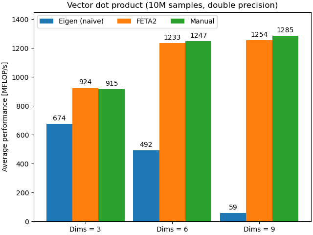

# FETA2.cuh
FETA2.cuh stands for Fast Expression Template Algebra for CUDA/C++.
It allows you to make use of the powerful and well-established [Eigen](https://eigen.tuxfamily.org/)
C++ linear algebra library in CUDA device code, while avoiding the hassle of CUDA's
memory management and its performance traps.

FETA2.cuh provides types representing [ensembles](https://en.wikipedia.org/wiki/Ensemble_%28mathematical_physics%29)
(i.e., large collections) of Eigen matrices/vectors.
For instance, a `feta::Vector3dEnsemble` behaves a lot like an
`std::vector<Eigen::Vector3d>`, but it'll be significantly faster for GPU computations,
and it greatly simplifies memory management on host, device global and device shared memory.

See `feta2_demo.cu` for a quick overview of FETA2's functionality.

FETA2 is particularly useful if you want to parallelise a _many
small_ but independent linear algebra operations in GPU code.
For instance, if you have 1M matrices and want to multiply each by a vector,
FETA2 allows you to easily perform each matrix-vector operation in a different
thread on the GPU.
This kind of scenario is common in scientific computing, for instance in
 Monte-Carlo simulations.

FETA2 is **not** useful if you want to accelerate a _few large_ linear algebra operations.
For this you should use dedicated libraries such as [cuBLAS](https://developer.nvidia.com/cublas)
or Eigen's [tensor module](https://eigen.tuxfamily.org/dox/unsupported/eigen_tensors.html).

## Why not just Eigen?

You may ask: why not just use Eigen by itself?
After all, it seems pretty straightforward:

```cpp
__global__ void matMul(Eigen::Matrix3d* mats, Eigen::Vector3d* vecs, int nSamples)
{
    const int i = threadIdx.x + blockIdx.x * blockDim.x;

    if (i >= nSamples) return;

    vecs[i] = mats[i] * vecs[i];
}
```

While this code works, it has a hidden _performance trap_.
The issue is memory layout: each matrix/vector is stored contiguously in memory.
For instance, the data in the `Vector3d*` is stored as `xyzxyzxyzxyz...`.
This leads to _strided accesses_ to global memory, which has a dramatic
[impact on performance](https://docs.nvidia.com/cuda/cuda-c-best-practices-guide/index.html#strided-accesses).

To mitigate the issue, we should use a different memory layout, where each component
of each vector is contiguous in memory: `xxx...yyy...zzz...`.
This will lead to improved cache utilisation and greatly improved performance.
You may know these two layouts as the [AoS and SoA](https://en.wikipedia.org/wiki/AoS_and_SoA).

For vectors the solution is simple -- just store the vectors as columns in a row-major matrix.
But for matrices, it's not so obvious.

Enter FETA:

```cpp
__global__ void matMul(feta::Matrix3dEnsemble::GRef mats, feta::Vector3dEnsemble::GRef vecs)
{
    const feta::SampleIndex si(threadIdx.x, blockIdx.x, blockDim.x);

    if (si.global() >= vecs.size()) return;

    vecs[si] = mats[si] * vecs[si];
}
```

FETA's ensemble types allow you to treat them as if they were arrays of Eigen
objects, but use a GPU-optimised memory layout internally.
The element access operator, e.g. `mats[is]`, gives you access to a regular
Eigen matrix/vector type, just like with an array.

Here, `::GRef` stands for "global reference", and indicates that the type
references data that "lives" in GPU global memory.
FETA also allows you to easily work with shared memory, which is why
we use `SampleIndex` -- but that is a topic for another time.


## Benchmarks

All benchmarks reported here were performed on an NVIDIA Tesla V100 16GB GPU, with 10M
samples, averaged over 100k repetitions, and using double-precision arithmetic.
The code for each can be found under `tests/benchmarks`.

"Eigen (naive)" refers to simply passing an array of Eigen objects (e.g., `Eigen::Vector3d *`) 
into the kernel. "Manual" refers to a manual but well-optimised implementation, i.e. passing
a raw array of `double`s and using a GPU-optimised memory layout.
Finally, "FETA2" implementations use FETA2's ensemble types and then use Eigen's vector
arithmetics to actually perform the operations.

- **Vector dot product** `out[i] = a[i].dot(b[i])` for 3D, 6D and 9D vectors.




